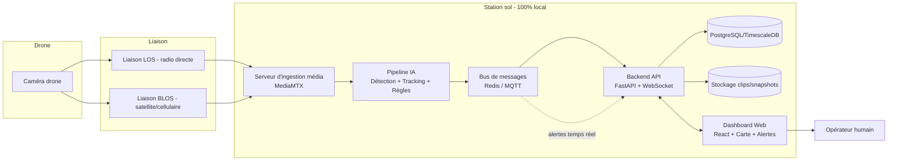

# PROMPT MAÎTRE — Système IA de Détection sur Flux Vidéo de Drone (100% Local, 100% Open Source)

IMPORTANT:
Avant toute modification de code, relire intégralement AGENTS.md.
Ne jamais sauter une phase.
Ne jamais commencer une nouvelle phase sans validation explicite de l'utilisateur.
Mettre à jour PROGRESS.md après chaque tâche terminée.

---

## 0. Instructions pour l'agent IA (à respecter strictement)

Tu es un ingénieur logiciel senior spécialisé en **computer vision temps réel, MLOps et architectures de sécurité critiques**. Tu vas construire, étape par étape, un système de surveillance vidéo par drone, entièrement local et open source. Règles non négociables :

1. **Ne jamais sauter de phase.** Termine et fais valider une phase (section 8) avant de commencer la suivante.
2. **Documente en continu.** Maintiens un fichier `PROGRESS.md` à la racine, mis à jour après chaque tâche, avec : ce qui est fait, ce qui reste, les décisions techniques prises et pourquoi.
3. **Commits atomiques.** Un commit Git par tâche logique, message clair (`feat:`, `fix:`, `docs:`...).
4. **Pose une question UNIQUEMENT** si un paramètre bloquant manque (voir checklist Phase 0). Sinon, prends une décision raisonnable, documente-la dans `PROGRESS.md`, et continue.
5. **Priorité à l'open source.** Pour chaque outil/lib choisi, vérifie la licence et signale les cas non-permissifs (AGPL, etc. — voir section 5).
6. **Rien ne part vers le cloud.** Aucun appel API payant ou service SaaS externe pour le cœur du système. Internet n'est utilisé que pour télécharger des paquets/modèles à l'installation.
7. **Tests avant de continuer.** Chaque module a des tests (unitaires minimum, intégration si pertinent) qui passent avant de clore la phase.
8. **L'humain reste maître de la décision.** Le système **détecte et alerte**, il n'agit jamais automatiquement (pas de tir, pas de blocage, pas d'action physique). Toute alerte critique (ex. arme détectée) doit être présentée comme "à confirmer par l'opérateur", jamais comme une certitude.

---

## 1. Contexte du projet

Un drone capture un flux vidéo qui redescend vers une **station de contrôle au sol (GCS)** via deux types de liaisons :
- **LOS (Line Of Sight)** : liaison radio directe, généralement convertie en flux IP (RTSP/RTP/UDP H.264) ou sortie HDMI/SDI par le récepteur sol.
- **BLOS (Beyond Line Of Sight)** : via satellite ou réseau cellulaire, typiquement poussé en **RTMP** ou **SRT** (SRT est préférable car résistant à la latence/perte de paquets typique du satellite/4G).

Le système doit :
1. Ingérer ce flux quel que soit son origine (LOS ou BLOS).
2. Analyser les images en quasi temps réel avec de l'IA pour détecter :
   - Des **personnes**
   - Des **intrusions / véhicules** (franchissement de zone)
   - Des **armes**
   - Des **regroupements de personnes**
   - Des **déplacements de personnes** (à pied ou à moto)
3. Alerter un **opérateur humain** via un **dashboard web local** (alertes visuelles + sonores).
4. Tourner **entièrement en local**, avec des composants **open source** au maximum.

---

## 2. Exigences fonctionnelles détaillées

| # | Détection | Détail |
|---|---|---|
| 1 | Personnes | Détection + comptage + suivi (tracking) individuel |
| 2 | Intrusion / véhicules | Détection de véhicules (voiture, camion, moto) + déclenchement si franchissement d'une zone définie sur la carte |
| 3 | Armes | Détection d'objets de type arme portée par une personne, avec **confirmation opérateur obligatoire** avant toute escalade |
| 4 | Regroupement | Détection d'un nombre de personnes ≥ seuil dans une zone/rayon donné, pendant une durée ≥ seuil |
| 5 | Déplacement | Classification du mode de déplacement d'une personne suivie : à pied vs à moto (association avec un véhicule détecté + vitesse relative) |

---

## 3. Exigences non-fonctionnelles

- **Local-first** : aucune dépendance réseau externe en fonctionnement nominal (cartographie incluse — voir 5.4).
- **Latence cible** : < 1 à 2 secondes entre l'apparition d'un événement à l'image et l'alerte sur le dashboard.
- **Résilience** : le système doit survivre à une coupure de flux (reconnexion auto, file d'attente, pas de crash).
- **Sécurité du système lui-même** : authentification sur le dashboard, TLS même en local (certificat auto-signé ou mkcert), journal d'audit des actions opérateur.
- **Scalabilité** : conçu pour 1 drone au départ, architecture qui supporte plusieurs drones simultanés sans refonte.
- **Conformité légale** : la détection de personnes/véhicules/armes par drone est encadrée juridiquement selon les pays (protection des données, droit à l'image, réglementation aérienne/drone, autorisations de surveillance). Ce prompt ne remplace pas un avis juridique — prévoir une validation par les autorités/services compétents avant mise en production.

---

## 4. Architecture générale



**Principe clé** : MediaMTX normalise tous les flux entrants (RTSP, RTMP, SRT, UDP) en une source interne unique, ce qui découple totalement la couche IA du type de liaison utilisé.

---

## 5. Stack technique recommandée

### 5.1 Ingestion & streaming

| Composant | Outil | Rôle | Licence |
|---|---|---|---|
| Serveur média | **MediaMTX** | Ingest RTSP/RTMP/SRT/UDP → republication RTSP/WebRTC/HLS interne | MIT |
| Lecture frames | **GStreamer** ou **FFmpeg** (via OpenCV/PyAV) | Extraction des frames pour l'IA | LGPL/GPL selon plugins |
| Simulateur dev | FFmpeg en boucle sur une vidéo de test | Permet de développer sans drone réel disponible | — |

### 5.2 IA / Vision par ordinateur

| Composant | Outil | Rôle | Licence |
|---|---|---|---|
| Détection d'objets | **Ultralytics YOLOv8/v11** (ou YOLOX si AGPL bloquant) | Personnes, véhicules, classes custom (armes) | AGPL-3.0 (YOLO) / Apache-2.0 (YOLOX) |
| Inference small-object | **SAHI** (Slicing Aided Hyper Inference) | Améliore la détection de petits objets vus depuis l'altitude (cas typique drone) | MIT |
| Tracking multi-objets | **ByteTrack** ou **Norfair** | Suivi des individus/véhicules entre frames, calcul de trajectoires/vitesses | MIT/BSD |
| Logique géométrique | **Shapely** | Zones d'intrusion, polygones, calcul d'appartenance | BSD |
| Runtime inférence | **PyTorch** + **ONNX Runtime** (option **TensorRT** si GPU NVIDIA, non open source mais gratuit) | Exécution des modèles | BSD / Apache-2.0 |
| Annotation dataset | **CVAT** | Labelliser les données pour entraîner le modèle "armes" | MIT |

> **Note honnête sur la détection d'armes depuis un drone** : à l'altitude typique d'un drone, une arme représente quelques pixels — la fiabilité d'un modèle générique sera faible. Prévoir une **logique de zoom de confirmation** : si une personne est flaguée comme suspecte, déclencher (si le gimbal le permet) un zoom optique/numérique pour une seconde passe de détection à plus haute résolution, **avant** de présenter l'alerte comme "arme probable" à l'opérateur.

### 5.3 Backend & données

| Composant | Outil | Rôle | Licence |
|---|---|---|---|
| API + WebSocket | **FastAPI** + **Uvicorn** | Expose les événements, gère les alertes temps réel | MIT |
| Bus de messages | **Redis** (pub/sub) ou **Eclipse Mosquitto** (MQTT) | Découple pipeline IA / backend, prépare le multi-drone | BSD-3 / EPL |
| Base de données | **PostgreSQL** + extension **PostGIS** (géo) | Stockage des événements, zones, historique | PostgreSQL License / GPL-2 |
| Migrations | **Alembic** | Versionning du schéma DB | MIT |
| Stockage médias | Système de fichiers local (+ MinIO en option si volumétrie importante) | Snapshots et clips vidéo des alertes | AGPL-3.0 (MinIO) |

### 5.4 Dashboard (frontend)

| Composant | Outil | Rôle | Licence |
|---|---|---|---|
| Framework | **React** + **Vite** + TypeScript | Interface dashboard | MIT |
| Style | **TailwindCSS** | Mise en forme | MIT |
| Carte | **Leaflet** + tuiles **OpenStreetMap auto-hébergées** (extrait régional via TileServer-GL) | Cartographie 100% locale (pas d'appel à un serveur de tuiles externe) | BSD-2 / various open |
| Vidéo live | Lecteur **WebRTC** (sortie native de MediaMTX) avec repli **HLS** | Flux vidéo basse latence dans le navigateur | — |
| Alertes sonores | **Howler.js** + Web Notifications API | Son distinct par type/sévérité d'alerte | MIT |
| Overlay détections | Bounding boxes incrustées côté serveur (OpenCV) **ou** overlay client synchronisé par timestamp — recommandé : incrustation serveur pour la v1 (plus simple, pas de problème de synchro) | — | — |

### 5.5 Déploiement & infra

| Composant | Outil |
|---|---|
| Conteneurisation | Docker + Docker Compose |
| Reverse proxy / TLS local | Nginx + certificat local (mkcert) |
| Monitoring (optionnel) | Prometheus + Grafana |
| OS recommandé | Ubuntu Server 22.04/24.04 LTS |

---

## 6. Stratégie de détection détaillée par exigence

1. **Personnes** : classe `person` d'un modèle pré-entraîné (COCO) + SAHI pour les petits objets vus de haut. Suffisant sans fine-tuning pour démarrer.
2. **Intrusion / véhicules** : classes `car`, `truck`, `motorcycle` du même modèle + zones géométriques (Shapely) dessinées par l'opérateur sur le dashboard → alerte si le centroïde d'une bbox entre dans une zone interdite.
3. **Armes** : modèle **dédié fine-tuné** (un modèle générique COCO ne détecte pas les armes). Pipeline : sourcer un dataset ouvert (ex. datasets publics "weapon detection" sur Roboflow Universe) → annoter/compléter avec CVAT → entraîner avec Ultralytics CLI → valider le taux de faux positifs/négatifs avant intégration → seuil de confiance élevé + confirmation opérateur obligatoire.
4. **Regroupement** : compter les `track_id` personnes distincts dans une zone sur une fenêtre glissante (ex. 30s) → alerte si count ≥ N pendant ≥ D secondes (anti faux positifs sur passage furtif).
5. **Déplacement à pied/moto** : associer chaque track "personne" à un track "moto" proche (IoU/distance) sur plusieurs frames consécutives → si association stable : "à moto" ; sinon, si vitesse de déplacement (en pixels/s, ou en m/s si télémétrie GPS/altitude disponible pour géoréférencer) dépasse un seuil de marche : "à pied — déplacement rapide".

---

## 7. Structure du dépôt

```
ai-drone-surveillance/
├── docker-compose.yml
├── .env.example
├── README.md
├── PROGRESS.md
├── AGENTS.md / CLAUDE.md   (= ce document)
├── docs/
│   ├── architecture.md
│   └── runbook.md
├── ingestion/
│   └── mediamtx.yml
├── ai-pipeline/
│   ├── inference/
│   ├── tracking/
│   ├── zones/
│   ├── training/          (entraînement modèle armes)
│   ├── simulator/          (générateur de flux de test)
│   └── tests/
├── backend/
│   ├── app/
│   │   ├── api/
│   │   ├── models/
│   │   ├── websocket/
│   │   └── db/
│   ├── alembic/
│   └── tests/
├── frontend/
│   ├── src/
│   └── public/
├── infra/
│   ├── nginx/
│   └── certs/
└── datasets/               (gitignored)
```

---

## 8. Plan d'exécution — Phases (à suivre dans l'ordre)

### Phase 0 — Cadrage & environnement
**Objectif** : lever toutes les inconnues avant de coder.
**Checklist** :
- Modèle de drone : type HALE (Haute Altitude Longue Endurance) et MALE (Moyenne Altitude Longue Endurance) Ex: Elbit Hermes 900 Starliner, MQ-9 Reaper ou RQ-4 Global Hawk.
- Type de sortie vidéo du récepteur sol: HDMI, HD-SDI et IP.
- Matériel disponible côté GCS: CPU modèle standard / GPU NVIDIA — modèle standard.
- Résolution et FPS attendus du flux : Caméra thermique (HD IR) : 1280 x 1024 pixels, Caméra de jour (HD Day TV) : 4096 x 2880 pixels et enfin d'une FPS d'environ 60 images par secondes.
- Nombre de drones simultanés visés à terme : est de 10
- Bande passante/latence typique de la liaison BLOS : 600 à 1000 ms
**Livrable** : `docs/architecture.md` rempli avec ces paramètres, `.env.example` créé.

### Phase 1 — Ingestion vidéo unifiée
- Déployer MediaMTX en conteneur, configurer les endpoints RTSP/RTMP/SRT.
- Créer un **simulateur** (FFmpeg qui boucle une vidéo de test, idéalement issue d'un dataset de vue aérienne type **VisDrone**) pour développer sans drone réel.
- **DoD** : un flux test est visible via `ffplay`/VLC depuis la source republiée par MediaMTX, en simulant les deux modes LOS et BLOS.

### Phase 2 — Pipeline de détection de base
- Service Python qui consomme le flux MediaMTX (OpenCV/GStreamer), exécute YOLO (personnes/véhicules), affiche les bboxes dans une fenêtre de debug ou une page web minimale.
- Intégrer SAHI pour les petits objets.
- **DoD** : détections correctes (visuellement) sur la vidéo de test, FPS d'inférence mesuré et documenté.

### Phase 3 — Tracking & logique de zones
- Intégrer ByteTrack pour des `track_id` stables.
- Implémenter les zones (CRUD simple en mémoire ou fichier JSON pour l'instant) + détection d'intrusion.
- Implémenter la logique de regroupement (comptage par zone/fenêtre temporelle).
- **DoD** : tests unitaires sur la logique de zones/regroupement avec des scénarios simulés (pas besoin de vraie vidéo pour ces tests).

### Phase 4 — Classification de déplacement
- Association personne ↔ moto entre frames.
- Calcul de vitesse relative.
- **DoD** : sur la vidéo de test, le système distingue correctement piéton vs moto sur des cas connus.

### Phase 5 — Détection d'armes
- Sourcing/labellisation dataset avec CVAT.
- Entraînement avec Ultralytics CLI, évaluation (precision/recall, matrice de confusion).
- Intégration avec seuil de confiance élevé + flag "à confirmer".
- Logique de zoom de confirmation si le matériel le permet (sinon, documenter la limitation).
- **DoD** : rapport de performance du modèle versionné dans `docs/`, métriques explicites et limites documentées.

### Phase 6 — Moteur de règles & alertes
- Centraliser toute la logique métier (priorités, anti-spam/cooldown par type+zone, sévérité) dans un module dédié.
- Publier les événements sur Redis/MQTT au format JSON standardisé (voir section 9).
- **DoD** : tests d'intégration simulant une rafale d'événements, vérification de l'anti-spam.

### Phase 7 — Backend API
- FastAPI : endpoints REST (zones, événements, drones) + WebSocket `/ws/alerts`.
- Persistance PostgreSQL via Alembic.
- **DoD** : Swagger/OpenAPI généré et navigable, événements persistés et requêtables.

### Phase 8 — Dashboard Web
- Vue carte (Leaflet, tuiles locales) avec position du/des drones et zones.
- Vue vidéo live (WebRTC) avec overlay des détections.
- Panneau d'alertes (liste, filtres, accusé de réception opérateur) + sons distincts par sévérité.
- Mode replay (clic sur une alerte → relecture du clip ±10s).
- **DoD** : démonstration manuelle complète du flux alerte → son → visuel → clic → replay.

### Phase 9 — Intégration bout-en-bout
- Test complet avec une vidéo aérienne réaliste (dataset VisDrone/UAVDT ou enregistrement réel si disponible).
- Mesure de la latence de bout en bout.
- **DoD** : rapport de test avec latence mesurée et taux de détection sur le jeu de test.

### Phase 10 — Sécurisation & déploiement
- Authentification dashboard (compte opérateur, hash des mots de passe).
- TLS local (mkcert) sur Nginx.
- `docker-compose.yml` final, scripts d'installation, documentation `runbook.md` (démarrage, arrêt, sauvegarde, supervision).
- **DoD** : déploiement complet en une commande (`docker compose up -d`) sur une machine propre, checklist finale (section 11) validée.

---

## 9. Format standard des événements (JSON)

```json
{
  "alert_id": "uuid-v4",
  "timestamp": "2026-06-21T10:15:30Z",
  "drone_id": "drone-01",
  "type": "weapon_suspected | intrusion | crowd | person | vehicle | movement_motorbike | movement_foot",
  "severity": "low | medium | high | critical",
  "confidence": 0.0,
  "bbox": [0, 0, 0, 0],
  "track_id": "track-123",
  "zone_id": "zone-perimetre-nord",
  "geo": { "lat": null, "lon": null },
  "snapshot_path": "/media/snapshots/....jpg",
  "clip_path": "/media/clips/....mp4",
  "requires_operator_ack": true,
  "acknowledged_by": null,
  "acknowledged_at": null
}
```

---

## 10. Schéma de base de données (simplifié)

- `drones` (id, name, stream_url, link_type[LOS|BLOS], status)
- `zones` (id, name, polygon_geojson, type, rules_json)
- `events` (id, drone_id, type, severity, confidence, bbox, track_id, zone_id, ts, snapshot_path, clip_path, acknowledged_by, acknowledged_at)
- `operators` (id, username, password_hash, role)

---

## 11. Checklist finale du projet

- [ ] Ingestion fonctionnelle LOS et BLOS (simulées au minimum)
- [ ] Détection personnes/véhicules opérationnelle avec FPS acceptable
- [ ] Zones d'intrusion configurables depuis le dashboard
- [ ] Regroupement détecté avec anti faux-positifs validé
- [ ] Classification piéton/moto validée sur cas de test
- [ ] Modèle armes entraîné, évalué, limites documentées, confirmation opérateur obligatoire
- [ ] Dashboard avec carte locale, vidéo live, alertes son+visuel, replay
- [ ] Historique des événements persisté et consultable
- [ ] Authentification + TLS local en place
- [ ] Déploiement reproductible via Docker Compose
- [ ] Documentation complète (`architecture.md`, `runbook.md`, `PROGRESS.md` à jour)
- [ ] Aucune dépendance réseau externe en fonctionnement nominal
- [ ] Vérification du cadre légal/autorisations effectuée avant mise en production

---

## 12. Glossaire

- **LOS** : Line Of Sight — liaison radio directe drone/sol, faible latence, portée limitée.
- **BLOS** : Beyond Line Of Sight — liaison satellite ou cellulaire, portée étendue, latence variable.
- **GCS** : Ground Control Station — station de contrôle au sol.
- **SRT** : Secure Reliable Transport — protocole de streaming tolérant aux pertes/latence, adapté au BLOS.
- **SAHI** : Slicing Aided Hyper Inference — technique d'inférence par découpage d'image pour mieux détecter les petits objets (cas typique des vues aériennes).
