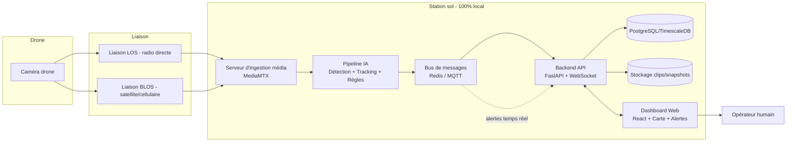

# Système de Surveillance par Drone — 100% Local, 100% Open Source

Système de surveillance vidéo par drone avec détection IA temps réel, entièrement local et open source. Détection de personnes, véhicules, armes, regroupements et déplacements, avec alertes vers un dashboard web.

## 🎯 Contexte et Objectifs

Ce système est conçu pour des opérations de surveillance et de sécurité utilisant des drones HALE (High Altitude Long Endurance) et MALE (Medium Altitude Long Endurance). Le drone capture un flux vidéo qui est transmis vers une station de contrôle au sol (GCS) via deux types de liaisons :

- **LOS (Line Of Sight)** : liaison radio directe, convertie en flux IP (RTSP/RTP/UDP H.264) ou sortie HDMI/SDI
- **BLOS (Beyond Line Of Sight)** : via satellite ou réseau cellulaire, typiquement poussé en RTMP ou SRT

### Objectifs principaux

- **Détection temps réel** : Personnes, véhicules, armes, regroupements, déplacements (pied/moto)
- **100% local** : Aucune dépendance cloud pour le cœur du système (cartographie incluse)
- **100% open source** : Composants open source au maximum
- **Alertes opérateur** : Dashboard web avec alertes visuelles et sonores
- **Confirmation humaine** : Le système détecte et alerte, l'opérateur décide (jamais d'action automatique)

### Scénarios opérationnels supportés

- Surveillance de zones sensibles (frontières, infrastructures critiques)
- Détection d'intrusions et de véhicules non autorisés
- Identification de regroupements suspects
- Repérage d'armes (avec confirmation opérateur obligatoire)
- Suivi des déplacements (piétons vs véhicules)

## 🏗️ Architecture

```
Drone → Liaison LOS/BLOS → MediaMTX → Pipeline IA → Redis/MQTT → FastAPI → Dashboard
```

### Architecture détaillée



### Stack technique

| Composant | Outil | Licence |
|-----------|-------|---------|
| Ingestion média | MediaMTX | MIT |
| Détection IA | YOLOv8/v11 + SAHI | AGPL-3.0 / MIT |
| Tracking | ByteTrack | MIT |
| Backend | FastAPI + Uvicorn | MIT |
| Bus de messages | Redis | BSD-3 |
| Base de données | PostgreSQL + PostGIS | PostgreSQL License / GPL-2 |
| Frontend | React + Vite + TypeScript | MIT |
| Cartographie | Leaflet + tuiles OSM auto-hébergées | BSD-2 |
| Déploiement | Docker + Docker Compose | — |

### Spécifications matérielles supportées

**Drones** :
- Types : HALE (ex: RQ-4 Global Hawk) et MALE (ex: Elbit Hermes 900 Starliner, MQ-9 Reaper)
- Sortie vidéo : HDMI, HD-SDI, IP
- Résolution/FPS :
  - Thermique (HD IR) : 1280x1024 @ 60 FPS
  - Jour (HD Day TV) : 4096x2880 @ 60 FPS

**Station sol (GCS)** :
- CPU standard + GPU NVIDIA (recommandé pour IA)
- Supporte jusqu'à 10 drones simultanés
- Bande passante BLOS : 2 à 45 Mbps
- Latence BLOS : 600 à 1000 ms

**Performance cible** :
- Latence IA : < 1 seconde
- Latence bout-en-bout : < 2 secondes
- FPS inférence : 3-4 FPS sur CPU (YOLOv8n), 30+ FPS sur GPU

## 📋 Exigences fonctionnelles

| # | Détection | Détail |
|---||---|
| 1 | Personnes | Détection + comptage + tracking individuel |
| 2 | Intrusion / véhicules | Détection de véhicules (voiture, camion, moto) + déclenchement si franchissement d'une zone définie sur la carte |
| 3 | Armes | Détection d'objets de type arme portée par une personne, avec **confirmation opérateur obligatoire** avant toute escalade |
| 4 | Regroupement | Détection d'un nombre de personnes ≥ seuil dans une zone/rayon donné, pendant une durée ≥ seuil |
| 5 | Déplacement | Classification du mode de déplacement d'une personne suivie : à pied vs à moto (association avec un véhicule détecté + vitesse relative) |

## 🚀 Démarrage rapide

### Prérequis

- Docker et Docker Compose installés
- FFmpeg installé (pour le simulateur de flux)
- 8 Go RAM minimum (16 Go recommandé)
- GPU NVIDIA optionnel (pour performances IA optimisées)

### Installation

```bash
# Cloner le dépôt
git clone <repo-url>
cd ai-drone-surveillance

# Copier les variables d'environnement
cp .env.example .env

# Lancer tous les services
docker compose up -d

# Accéder au dashboard
# http://localhost:3000
# Login par défaut : admin / admin123 (à changer en production)
```

### Simulateur de flux (pour développement sans drone)

```bash
# Générer une vidéo de test
cd ai-pipeline/simulator
python generate-test-video.ps1  # Windows
# ou
bash generate-test-video.sh     # Linux

# Démarrer le simulateur LOS
python simulate-los.ps1  # Windows
# ou
bash simulate-los.sh     # Linux

# Démarrer le simulateur BLOS
python simulate-blos.ps1  # Windows
# ou
bash simulate-blos.sh     # Linux
```

## 📁 Structure du dépôt

```
ai-drone-surveillance/
├── docker-compose.yml          # Orchestration des services Docker
├── .env.example                # Variables d'environnement exemple
├── README.md                   # Ce fichier
├── PROGRESS.md                 # Suivi de progression du projet
├── AGENTS.md                   # Instructions pour l'agent IA
├── docs/
│   ├── architecture.md         # Architecture détaillée
│   ├── runbook.md              # Guide opérationnel
│   ├── weapon-detection-report.md  # Rapport modèle armes
│   └── integration-test-report.md   # Rapport tests intégration
├── ingestion/
│   └── mediamtx.yml            # Configuration MediaMTX
├── ai-pipeline/
│   ├── inference/              # Module de détection YOLO
│   ├── tracking/               # Module ByteTrack + classification mouvement
│   ├── zones/                  # Gestion zones géographiques + crowd detection
│   ├── rules/                  # Moteur de règles + alertes + publisher Redis
│   ├── training/               # Entraînement modèle armes
│   ├── storage/                # Stockage snapshots/clips
│   ├── integration/            # Tests d'intégration
│   ├── simulator/              # Simulateur de flux FFmpeg
│   └── tests/                  # Tests unitaires
├── backend/
│   ├── app/
│   │   ├── api/                # Routes REST (drones, zones, events, auth)
│   │   ├── models/             # Modèles SQLAlchemy
│   │   ├── websocket/          # WebSocket alerts
│   │   ├── db/                 # Configuration PostgreSQL
│   │   ├── auth/               # Authentification JWT
│   │   └── services/           # Services d'arrière-plan
│   ├── alembic/                # Migrations DB
│   └── tests/                  # Tests backend
├── frontend/
│   ├── src/
│   │   ├── pages/              # Pages React (Login, Dashboard)
│   │   ├── components/         # Composants (MapView, VideoPlayer, AlertPanel)
│   │   ├── hooks/              # Hooks React (useAuth, useAlerts, useDrones)
│   │   ├── services/           # Client API Axios
│   │   └── types/              # Types TypeScript
│   ├── public/
│   ├── Dockerfile              # Build multi-stage
│   └── nginx.conf              # Configuration Nginx
├── infra/
│   ├── nginx/                  # Configuration reverse proxy
│   └── tileserver/             # Tuiles OSM locales
├── datasets/                   # Datasets d'entraînement
├── data/                       # Données temporaires (vidéos test)
└── scripts/                    # Scripts d'installation/utilitaires
```

## 📖 Documentation

- **[Architecture détaillée](docs/architecture.md)** — Spécifications techniques et stack
- **[Guide opérationnel](docs/runbook.md)** — Démarrage, arrêt, sauvegarde, supervision, dépannage
- **[PROGRESS.md](PROGRESS.md)** — Suivi de progression du projet (phases complétées)
- **[AGENTS.md](AGENTS.md)** — Instructions pour l'agent IA
- **[Rapport modèle armes](docs/weapon-detection-report.md)** — Performance et limites du modèle de détection d'armes
- **[Rapport tests intégration](docs/integration-test-report.md)** — Résultats des tests bout-en-bout

## 🔧 Configuration

Voir `.env.example` pour toutes les variables d'environnement configurables :

- Ports des services (MediaMTX, Redis, PostgreSQL, FastAPI, Frontend)
- Paramètres IA (modèle, seuils, SAHI, device CPU/GPU)
- Règles de détection (seuils de regroupement, vitesse, cooldowns)
- Stockage médias (répertoire, durée clips, FPS)
- Authentification (credentials par défaut, secret JWT)

## 📊 État d'avancement

Le projet est actuellement en **Phase 10 (Sécurisation & déploiement)**.

Phases complétées :
- ✅ Phase 0 — Cadrage & environnement
- ✅ Phase 1 — Ingestion vidéo unifiée (MediaMTX)
- ✅ Phase 2 — Pipeline de détection de base (YOLO)
- ✅ Phase 3 — Tracking & logique de zones (ByteTrack)
- ✅ Phase 4 — Classification de déplacement (piéton vs moto)
- ✅ Phase 5 — Détection d'armes (modèle dédié)
- ✅ Phase 6 — Moteur de règles & alertes (Redis)
- ✅ Phase 7 — Backend API (FastAPI + WebSocket)
- ✅ Phase 8 — Dashboard Web (React + Leaflet)
- ✅ Phase 9 — Intégration bout-en-bout (tests VisDrone)
- ✅ Phase 10 — Sécurisation & déploiement

Voir [PROGRESS.md](PROGRESS.md) pour les détails de chaque phase.

## ⚠️ Conformité légale

La détection de personnes/véhicules/armes par drone est encadrée juridiquement selon les pays (protection des données, droit à l'image, réglementation aérienne/drone, autorisations de surveillance). Ce projet ne remplace pas un avis juridique — une validation par les autorités/services compétents est requise avant toute mise en production.

## � Sécurité

- **Authentification** : Login par JWT sur le dashboard (credentials par défaut : admin/admin123)
- **TLS** : Support HTTPS avec certificats auto-signés (optionnel)
- **Audit** : Journal des actions opérateur dans la base de données
- **Pas d'action automatique** : Le système détecte et alerte, l'opérateur décide

## �📄 Licence

À définir (projet open source)

## 🤝 Contribution

Ce projet est en développement actif. Voir [PROGRESS.md](PROGRESS.md) pour l'état actuel.

## 📞 Support

Pour toute question ou problème :
- Consulter le [guide opérationnel](docs/runbook.md) pour le dépannage
- Vérifier les logs des services Docker (`docker compose logs`)
- Consulter les rapports de tests dans le dossier `docs/`
