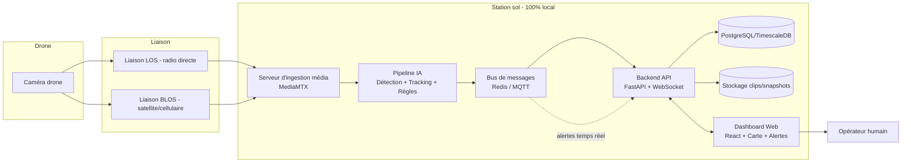

# Architecture du Système de Surveillance par Drone

## 1. Contexte opérationnel

### 1.1 Modèles de drone supportés
Le système est conçu pour supporter deux catégories de drones :
- **HALE (Haute Altitude Longue Endurance)** : Ex: RQ-4 Global Hawk
- **MALE (Moyenne Altitude Longue Endurance)** : Ex: Elbit Hermes 900 Starliner, MQ-9 Reaper

### 1.2 Liaisons de communication

#### LOS (Line Of Sight)
- Liaison radio directe drone/sol
- Faible latence
- Portée limitée (~100-200 km selon altitude)
- Sortie typique : RTSP/RTP/UDP H.264 ou HDMI/SDI

#### BLOS (Beyond Line Of Sight)
- Liaison satellite ou réseau cellulaire (4G/5G)
- Portée étendue (mondiale)
- Latence variable : **600 à 1000 ms**
- Bande passante : **2 à 45 Mbps**
- Protocole recommandé : SRT (Secure Reliable Transport) pour sa tolérance aux pertes/latence
- Alternative : RTMP

### 1.3 Spécifications vidéo

| Type | Résolution | FPS | Notes |
|------|------------|-----|-------|
| Caméra thermique (HD IR) | 1280 x 1024 | 60 | Détection nuit/conditions visibles réduites |
| Caméra de jour (HD Day TV) | 4096 x 2880 | 60 | Haute résolution pour identification |

### 1.4 Sortie récepteur sol
- HDMI
- HD-SDI
- IP (RTSP/RTMP/SRT/UDP)

### 1.5 Matériel GCS (Ground Control Station)
- CPU : modèle standard
- GPU : NVIDIA (modèle standard)
- Scalabilité : **10 drones simultanés** visés à terme

---

## 2. Architecture système



### 2.1 Ingestion média (MediaMTX)
- Rôle : Normaliser tous les flux entrants (RTSP, RTMP, SRT, UDP) en une source interne unique
- Sorties : RTSP, WebRTC, HLS
- Découplage : La couche IA est totalement indépendante du type de liaison utilisé

### 2.2 Pipeline IA
- **Détection** : YOLOv8/v11 + SAHI (small-object inference)
- **Tracking** : ByteTrack ou Norfair
- **Logique géométrique** : Shapely (zones, polygones)
- **Runtime** : PyTorch + ONNX Runtime (option TensorRT si GPU NVIDIA)

### 2.3 Backend
- **API** : FastAPI + Uvicorn
- **Bus de messages** : Redis (pub/sub) ou MQTT
- **Base de données** : PostgreSQL + PostGIS (géospatial)
- **Migrations** : Alembic

### 2.4 Frontend
- **Framework** : React + Vite + TypeScript
- **Style** : TailwindCSS
- **Carte** : Leaflet + tuiles OpenStreetMap auto-hébergées (TileServer-GL)
- **Vidéo** : WebRTC (priorité) avec repli HLS
- **Alertes** : Howler.js + Web Notifications API

---

## 3. Stack technique détaillé

### 3.1 Ingestion & streaming

| Composant | Outil | Rôle | Licence |
|---|---|---|---|
| Serveur média | **MediaMTX** | Ingest RTSP/RTMP/SRT/UDP → republication RTSP/WebRTC/HLS interne | MIT |
| Lecture frames | **GStreamer** ou **FFmpeg** (via OpenCV/PyAV) | Extraction des frames pour l'IA | LGPL/GPL selon plugins |
| Simulateur dev | FFmpeg en boucle sur une vidéo de test | Permet de développer sans drone réel | — |

### 3.2 IA / Vision par ordinateur

| Composant | Outil | Rôle | Licence |
|---|---|---|---|
| Détection d'objets | **Ultralytics YOLOv8/v11** (ou YOLOX si AGPL bloquant) | Personnes, véhicules, classes custom (armes) | AGPL-3.0 (YOLO) / Apache-2.0 (YOLOX) |
| Inference small-object | **SAHI** | Améliore la détection de petits objets vus depuis l'altitude | MIT |
| Tracking multi-objets | **ByteTrack** ou **Norfair** | Suivi des individus/véhicules entre frames | MIT/BSD |
| Logique géométrique | **Shapely** | Zones d'intrusion, polygones, calcul d'appartenance | BSD |
| Runtime inférence | **PyTorch** + **ONNX Runtime** (option **TensorRT**) | Exécution des modèles | BSD / Apache-2.0 |
| Annotation dataset | **CVAT** | Labelliser les données pour entraîner le modèle "armes" | MIT |

### 3.3 Backend & données

| Composant | Outil | Rôle | Licence |
|---|---|---|---|
| API + WebSocket | **FastAPI** + **Uvicorn** | Expose les événements, gère les alertes temps réel | MIT |
| Bus de messages | **Redis** (pub/sub) ou **Eclipse Mosquitto** (MQTT) | Découple pipeline IA / backend | BSD-3 / EPL |
| Base de données | **PostgreSQL** + extension **PostGIS** | Stockage des événements, zones, historique | PostgreSQL License / GPL-2 |
| Migrations | **Alembic** | Versionning du schéma DB | MIT |
| Stockage médias | Système de fichiers local (+ MinIO en option) | Snapshots et clips vidéo des alertes | AGPL-3.0 (MinIO) |

### 3.4 Dashboard (frontend)

| Composant | Outil | Rôle | Licence |
|---|---|---|---|
| Framework | **React** + **Vite** + TypeScript | Interface dashboard | MIT |
| Style | **TailwindCSS** | Mise en forme | MIT |
| Carte | **Leaflet** + tuiles **OpenStreetMap auto-hébergées** | Cartographie 100% locale | BSD-2 / various open |
| Vidéo live | Lecteur **WebRTC** avec repli **HLS** | Flux vidéo basse latence | — |
| Alertes sonores | **Howler.js** + Web Notifications API | Son distinct par type/sévérité | MIT |
| Overlay détections | Bounding boxes incrustées côté serveur (OpenCV) | — | — |

### 3.5 Déploiement & infra

| Composant | Outil |
|---|---|
| Conteneurisation | Docker + Docker Compose |
| Reverse proxy / TLS local | Nginx + certificat local (mkcert) |
| Monitoring (optionnel) | Prometheus + Grafana |
| OS recommandé | Ubuntu Server 22.04/24.04 LTS |

---

## 4. Exigences non-fonctionnelles

- **Local-first** : aucune dépendance réseau externe en fonctionnement nominal (cartographie incluse)
- **Latence cible** : < 1 à 2 secondes entre l'apparition d'un événement à l'image et l'alerte sur le dashboard
- **Résilience** : le système doit survivre à une coupure de flux (reconnexion auto, file d'attente, pas de crash)
- **Sécurité** : authentification sur le dashboard, TLS même en local (certificat auto-signé ou mkcert), journal d'audit des actions opérateur
- **Scalabilité** : conçu pour 1 drone au départ, architecture qui supporte 10 drones simultanés sans refonte
- **Conformité légale** : la détection de personnes/véhicules/armes par drone est encadrée juridiquement selon les pays — prévoir une validation par les autorités/services compétents avant mise en production

---

## 5. Stratégie de détection

### 5.1 Personnes
- Classe `person` d'un modèle pré-entraîné (COCO)
- SAHI pour les petits objets vus de haut
- Suffisant sans fine-tuning pour démarrer

### 5.2 Intrusion / véhicules
- Classes `car`, `truck`, `motorcycle` du même modèle COCO
- Zones géométriques (Shapely) dessinées par l'opérateur sur le dashboard
- Alertes si le centroïde d'une bbox entre dans une zone interdite

### 5.3 Armes
- Modèle dédié fine-tuné (un modèle générique COCO ne détecte pas les armes)
- Pipeline : sourcer dataset ouvert → annoter/compléter avec CVAT → entraîner avec Ultralytics CLI → valider taux de faux positifs/négatifs
- Seuil de confiance élevé + confirmation opérateur obligatoire
- Note : à l'altitude typique d'un drone, une arme représente quelques pixels — la fiabilité sera limitée

### 5.4 Regroupement
- Compter les `track_id` personnes distincts dans une zone sur une fenêtre glissante (ex. 30s)
- Alertes si count ≥ N pendant ≥ D secondes (anti faux positifs sur passage furtif)

### 5.5 Déplacement à pied/moto
- Associer chaque track "personne" à un track "moto" proche (IoU/distance) sur plusieurs frames consécutives
- Si association stable : "à moto"
- Sinon, si vitesse de déplacement dépasse un seuil de marche : "à pied — déplacement rapide"

---

## 6. Format standard des événements (JSON)

```json
{
  "alert_id": "uuid-v4",
  "timestamp": "2026-06-21T10:15:30Z",
  "drone_id": "drone-01",
  "type": "weapon_suspected | intrusion | crowd | person | vehicle | movement_motorbike | movement_foot",
  "severity": "low | medium | high | critical",
  "confidence": 0.0,
  "bbox": [0, 0, 0, 0],
  "track_id": "track-123",
  "zone_id": "zone-perimetre-nord",
  "geo": { "lat": null, "lon": null },
  "snapshot_path": "/media/snapshots/....jpg",
  "clip_path": "/media/clips/....mp4",
  "requires_operator_ack": true,
  "acknowledged_by": null,
  "acknowledged_at": null
}
```

---

## 7. Schéma de base de données (simplifié)

- `drones` (id, name, stream_url, link_type[LOS|BLOS], status)
- `zones` (id, name, polygon_geojson, type, rules_json)
- `events` (id, drone_id, type, severity, confidence, bbox, track_id, zone_id, ts, snapshot_path, clip_path, acknowledged_by, acknowledged_at)
- `operators` (id, username, password_hash, role)
